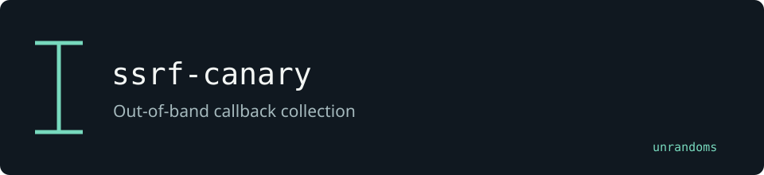

# ssrf-canary



Lightweight self-hosted out-of-band (OOB) callback server for validating blind SSRF, XXE, SSTI, and similar injection classes. Replaces Burp Collaborator in automated security testing pipelines.

## Features

- HTTP listener on configurable port (default 8080) — logs every request, extracts canary tokens from the path, `?token=` query param, or `X-Canary-Token` header
- DNS server on configurable port (default 5353) using `miekg/dns` — responds to all A queries for `*.DOMAIN` with the server IP
- Unique token generation per test — each token tracks every callback it receives
- REST API to poll callback status
- WebSocket endpoint `/ws` for real-time push notifications
- Optional TLS support

## Running locally

```
go install github.com/unrandoms/ssrf-canary@latest
ssrf-canary --domain canary.yourdomain.com --ip 1.2.3.4
```

Or build from source:

```
git clone https://github.com/unrandoms/ssrf-canary
cd ssrf-canary
go build -o canary .
./canary --domain canary.yourdomain.com --ip 1.2.3.4
```

Flags:

| Flag | Default | Description |
|------|---------|-------------|
| `--http-port` | 8080 | HTTP listener port |
| `--dns-port` | 5353 | DNS listener port (use 53 with root or CAP_NET_BIND_SERVICE) |
| `--domain` | canary.example.com | Base domain for DNS callbacks |
| `--ip` | auto | Public IP advertised in DNS A records |
| `--tls` | false | Enable HTTPS |
| `--cert` | | TLS certificate (PEM) |
| `--key` | | TLS private key (PEM) |

## Running via Docker

```
docker build -t ssrf-canary .
docker run -p 8080:8080 -p 5353:5353/udp ssrf-canary \
  --domain canary.yourdomain.com --ip 1.2.3.4
```

## Pentest workflow

### 1. Generate a token

```
curl http://localhost:8080/token
```

Response:

```json
{
  "token": "a1b2c3d4e5f6a1b2c3d4e5f6a1b2c3d4",
  "http_url": "http://1.2.3.4:8080/a1b2c3d4e5f6a1b2c3d4e5f6a1b2c3d4",
  "dns_host": "a1b2c3d4e5f6a1b2c3d4e5f6a1b2c3d4.canary.yourdomain.com"
}
```

### 2. Inject the URL or hostname into the target parameter

HTTP injection example:

```
curl 'https://target.com/fetch?url=http://1.2.3.4:8080/a1b2c3d4e5f6a1b2c3d4e5f6a1b2c3d4'
```

DNS injection example (SSTI, XXE, etc.):

```
# In a template field, inject something that resolves DNS:
# ${T(java.net.InetAddress).getByName("a1b2c3...d4.canary.yourdomain.com")}
```

### 3. Poll for callbacks

```
curl http://localhost:8080/check/a1b2c3d4e5f6a1b2c3d4e5f6a1b2c3d4
```

Response when seen:

```json
{
  "seen": true,
  "requests": [
    {
      "timestamp": "2024-01-15T10:30:00Z",
      "source_ip": "192.168.1.100:54321",
      "protocol": "http",
      "method": "GET",
      "path": "/a1b2c3d4e5f6a1b2c3d4e5f6a1b2c3d4",
      "headers": {"User-Agent": "Java/11.0.2"},
      "body": "",
      "query": ""
    }
  ]
}
```

### Other API endpoints

```
# List all active tokens
curl http://localhost:8080/list

# Clear all tokens
curl -X POST http://localhost:8080/clear

# WebSocket real-time stream
wscat -c ws://localhost:8080/ws
```

## Architecture

```
ssrf-canary/
  main.go                    # entry point
  cmd/root.go                # cobra CLI flags
  internal/
    server/
      server.go              # goroutine launcher
      http.go                # HTTP listener + token extraction middleware
      dns.go                 # DNS server (miekg/dns)
      websocket.go           # WebSocket hub
    store/
      store.go               # in-memory token store with TTL
    api/
      handlers.go            # REST handlers: /token /check/:token /list /clear /ws
  Dockerfile
```

## License and maintenance

Maintained by [unrandoms](https://github.com/unrandoms). Distributed under the [MIT License](LICENSE).
